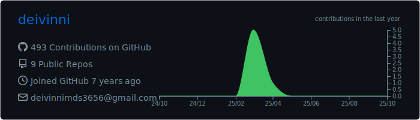

<h2>Deivinni Mayer da Silva</h2>

Tenho 18 anos, programo mais como um hobby e pretendo estudar e trabalhar neste ramo!

---

#### Redes Sociais:
> **Discord**: deivinni#7799 
> **Twitter**: <a href="https://twitter.com/deivinni_">@deivinni_</a> 
> **E-mail**: <a href="mailto:deivinnimds3656@gmail.com">deivinnimds3656@gmail.com</a> 

